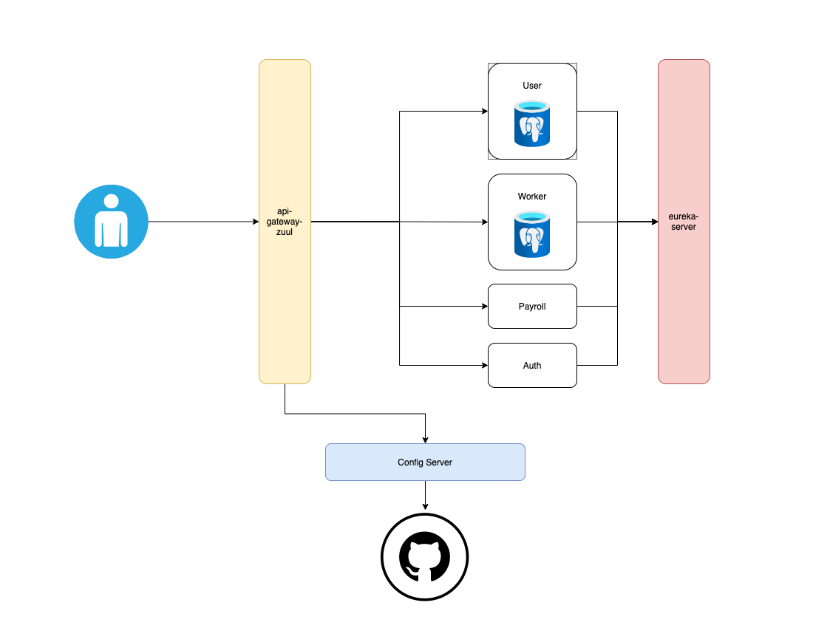

# Microservices Project

O projeto tem como objetivo apresentar uma rede microserviços simples 
mas com uma infraestrutura completa contendo Api Gateway, Service Discovery, 
Autenticação e um Service Configuration.

Para tanto, o projeto consiste nos seguintes microsserviços:

* Um microsserviço de Autenticação
* Um API Gateway
* Um repoistório no github para Configuração
* Um serivço de Service Discovery
* Um microsserviço simples de Users
* Um microsserviço simples de Workers
* Um microsserviço simples simulando uma chamada para uma API de pagamentos

## Startup do Projeto

### Requisitos para rodar o projeto
```
Maven 3.6.0
Java version 8
Docker version 19.03.8
Git version 2.19.0
```

### Intalação do Projeto
```bash
$ git clone https://github.com/daniel-acaz/microservices-proj.git
$ cd microservices-proj
$ docker-compose -f docker-compose.yml -f docker-compose.prod.yml up --build
$ ...aguarde alguns mintuos

### Atenção!
Os endereços de portas a seguir precisam estar disponíveis no seu sistema:

*8765
*8888
*5433
*5434
```

Será necessário conectar com os bancos de dados postgres e fazer as criações de tablea.
Para criar as tabela, usar o script SQL que está no arquivo create.sql na raiz deste projeto.

Após isso, será necessário inputar os dados de usuário (para podermos fazer o login).
Para isso, usar o script SQL que está na psta do projeto hr-user no arquivo data.sql.

## Arquitetura do Projeto

<p align="center">
    
</p> 
